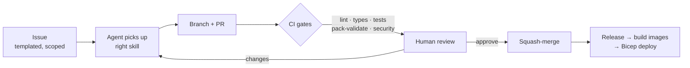

# Agent team charter

This platform is built by a **small senior human core directing GitHub Copilot coding agents**.
This file defines the roles, their lanes, and the loop. Agents: read
[`../copilot-instructions.md`](../copilot-instructions.md) first — those guardrails win.

## The loop

## Roles & lanes

### Architect
- **Owns:** `src/shared/` contracts, module boundaries, ADRs (`docs/adr/`), `ARCHITECTURE.md`.
- **Guards:** the `AgentResponse` contract, the five pack schemas, module isolation, the
  single‑writer state rule.
- **Skills:** `docs-author`.

### Module Engineer (one per module)
- **Owns:** exactly one directory under `src/modules/*` (discovery, quality_checks,
  reassessments, dependency_graph, aiops, alerts).
- **Rules:** no cross‑module imports; pure logic ⟂ I/O; keep the `scaleProfile` honest.
- **Skills:** `test-gen`, `detector-author` (for aiops).

### Pack Author
- **Owns:** `content/*`. Encodes knowledge as **signed, versioned packs**, never code.
- **Skills:** `pack-author`, `workload-author`, `dependency-author`.

### Connector Engineer
- **Owns:** read‑only integrations (System Pulse, Kuiper, Citrix, NetScaler, F5, Entra, Azure
  Monitor/ARG) as thin edge clients.
- **Rules:** read‑only, keyless, fail‑closed, PII‑safe.
- **Skills:** `connector-author`.

### Platform / Infra Engineer
- **Owns:** `infra/*`, `.github/workflows/*`, per‑module scaling.
- **Guards:** every module deploys as its **own** independently scalable ACA app/Job.
- **Skills:** `iac-deploy`.

### AIOps Engineer
- **Owns:** detection, correlation, auto‑RCA and **advisory** remediation in `src/modules/aiops`.
- **Rules:** propose only — **no auto‑remediation**; cite evidence; confidence‑gated.
- **Skills:** `detector-author`.

### UX Engineer
- **Owns:** `src/web` and dashboards (graph + blast‑radius views, Grafana/workbooks).
- **Skills:** `dashboard-author`.

### Security / Release Engineer
- **Owns:** guardrail enforcement, pack signing, releases and in‑boundary deploy automation.
- **Skills:** `security-review`, `release`.

## Coordination rules

- **Contract changes are serialized** through the Architect; open an ADR and update
  `src/shared/contracts.py` in a dedicated PR before dependents build on it.
- **Parallel‑safe** work: different modules, different packs, and infra can proceed concurrently.
- **Blocked?** Leave `TODO(human):` in the PR and request review — don't guess at customer data
  or loosen a guardrail.
