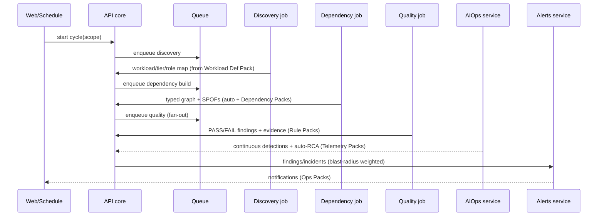

# Architecture

This document explains **how the platform is put together** and — most importantly — **why each
module is independently scalable**. It is the engineering companion to Blueprint doc 02
(*Solution Architecture*). Decisions here are binding for agents; deviations require an ADR in
`docs/adr/`.

## First principles

1. **In‑boundary by construction.** Every runtime component is deployed into the **customer's**
   Azure subscription. Sensitive data (PHI/PII, log bodies, config) is processed and stored only
   there. Only **signed content in** (packs) and **optional, aggregated, PII‑free findings out**
   (if the customer opts in) ever cross the boundary.
2. **Content over code.** Domain knowledge — what a workload *is*, what "good" means, how tiers
   depend on each other, what to watch, who to notify — lives in **versioned, signed packs**
   under `content/`, not in Python. Shipping knowledge does not require shipping code.
3. **Modules are the unit of capability *and* of scale.** A module is independently
   enable/disable‑able, independently versioned, and **independently scaled**.
4. **Keyless.** All Azure access uses **Managed Identity**; no secrets in code or config.
5. **Fail closed.** Unknown pack signature, unknown resource, or low confidence → **do not act**;
   surface for a human. No automatic remediation of customer infrastructure — ever.

## Component map

```mermaid
graph TD
    subgraph Customer Subscription (in-boundary)
        API[API core<br/>FastAPI · module registry · orchestrator]
        subgraph Modules independently scaled
            DISC[Discovery<br/>job]
            QC[Quality Checks<br/>job]
            RE[Reassessments<br/>job cron]
            DEP[Dependency & Blast Radius<br/>job]
            AIO[AIOps<br/>service]
            AL[Alerts<br/>service]
        end
        PE[Packs Engine<br/>load · verify sig · execute]
        ST[(State<br/>graph + findings + snapshots)]
        LA[(Log Analytics)]
        KV[(Key Vault)]
        MI((Managed Identity))
        WEB[Web SPA]
    end
    subgraph Azure control/data planes
        ARG[Azure Resource Graph]
        AM[Azure Monitor / Metrics / Logs]
    end
    subgraph Application planes read-only
        SP[Epic System Pulse]
        KU[Epic Kuiper]
        CTX[Citrix / NetScaler / F5]
    end
    MSFT[[Microsoft Pack Registry<br/>signed packs only]] -. signed content in .-> PE

    WEB --> API
    API --> PE
    API --> ST
    DISC & QC & RE & DEP & AIO & AL --> PE
    DISC --> ARG
    AIO --> AM
    AIO --> SP
    DISC --> KU
    DEP --> CTX
    API & Modules -. keyless .- MI
    Modules --> ST
```

## Independent scaling

**The requirement:** each module must scale independently to accommodate flexible workload sizes.
**The mechanism:**

- Every module owns a **`manifest.yaml`** with a `scaleProfile`:
  ```yaml
  scaleProfile:
    kind: job | service          # ACA Job (batch) or ACA app (long-running)
    minReplicas: 0
    maxReplicas: 30
    triggers:                    # KEDA scalers
      - type: azure-queue | cron | cpu | memory | custom
        metadata: { ... }
    resources: { cpu: 0.5, memoryGi: 1.0 }
  ```
- `infra/bicep/modules/module-job.bicep` and `module-app.bicep` are **reusable templates** that
  turn a scale profile into a real ACA Job / ACA app with **its own KEDA scale rule**. `main.bicep`
  iterates the enabled modules and stamps one deployment each.
- Because each module is a **separate ACA resource**, load in one never starves another:

  | Module | Kind | min→max | Primary trigger | Rationale |
  |--------|------|--------|-----------------|-----------|
  | discovery | job | 0→10 | cron + manual | Bursty, periodic sweeps |
  | quality_checks | job | 0→30 | queue `assessments` | Fan out one replica per workload/rule batch |
  | reassessments | job | 0→5 | cron | Scheduled drift runs |
  | dependency_graph | job | 0→10 | event (after discovery) | Rebuild graph on estate change |
  | aiops | service | 1→20 | queue `telemetry` + cpu | Always‑on detection, scales with signal volume |
  | alerts | service | 1→10 | queue `findings` | Always‑on routing |
  | api | service | 1→3 | HTTP | Single‑writer state constraint (see below) |
  | web | service | 1→3 | HTTP | Static SPA |

- **Scale to zero.** Job‑kind modules idle at `minReplicas: 0`, so a small workload costs almost
  nothing; a large one fans out automatically.

## State & the single‑writer constraint

State (dependency graph, findings, snapshots) is persisted as **blob‑snapshot + a small
transactional store**. The **API core is the single writer**; modules submit results to the API
rather than writing shared state concurrently. This keeps `api` at low replica counts while the
**compute‑heavy modules scale freely**. Read models are cached/queryable by the web SPA.

## Data flow (one assessment cycle)



## The five pack types (content contract)

| Pack | Answers | Consumed by |
|------|---------|-------------|
| **Workload Definition** | "What is this workload? Tiers, roles, signals" | Discovery |
| **Rule** | "What does good look like?" (WAF/WARA/APRL/app) | Quality Checks |
| **Telemetry** | "What do we watch and how do we detect?" | AIOps |
| **Dependency** | "What depends on what?" | Dependency Graph |
| **Ops** | "Who gets told, how, and what's the runbook?" | Alerts |

Packs are **signed** (SHA‑256 + HMAC) and **verified before execution** by the Packs Engine.
Both Microsoft and the customer can see and **pin which pack version runs against which workload**.

## Trust boundary & multi‑tenant delivery

- **Customer‑owned** deployment is the default; an MSP can manage many via **Azure Lighthouse**.
- **MSP‑hosted multi‑tenant**: one instance, strict per‑client data isolation (row/partition +
  RBAC scoping); a client never sees another client's data.
- Microsoft ships **signed packs only** into either model; no customer data returns by default.

## Technology choices (summary)

| Concern | Choice | Note |
|---------|--------|------|
| API | **FastAPI + Pydantic** | Typed contracts = agent‑friendly |
| Modules/worker | Python, run as **ACA Jobs/apps** | one entrypoint `cli.worker` |
| Web | **React + Vite + TypeScript** | read models + graph/blast‑radius views |
| Telemetry store | **Azure Log Analytics** (KQL) first | Fabric/Data Explorer optional at scale |
| Dashboards | **Azure Managed Grafana** + workbooks | graph/blast‑radius visual |
| Compute | **Azure Container Apps** (+ Jobs) | native KEDA scale, scale‑to‑zero |
| Identity | **Managed Identity** everywhere | keyless |
| IaC | **Bicep** via **azd** | per‑module templates |
| Packs registry | signed artifacts | SHA‑256 + HMAC verified |

See `docs/adr/` for the rationale trail; see the Blueprint (`docs/README.md`) for full depth.
