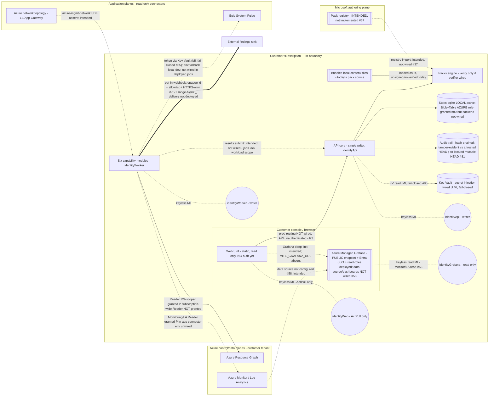

# Threat model

A STRIDE-style threat model for the in-boundary Workloads Platform (codename *Aegis*). It is
grounded in the **actual** code and infrastructure in this repository — every claim below points at
the file it is based on, and each control carries an explicit **enforcement status** (several are
designed or partly implemented but **not yet enforced**). It is the security companion to
[`ARCHITECTURE.md`](../../ARCHITECTURE.md) and [`SECURITY.md`](../../SECURITY.md); where those docs
and the code diverge, the divergence is called out under
[*Residual risks & known gaps*](#residual-risks--known-gaps).

> Scope: the runtime platform (Discovery, Quality Checks, Reassessments, Dependency & Blast Radius,
> AIOps, Alerts) plus the packs engine, state + audit layer, connectors, web console, the **public
> Managed Grafana visualization surface** (#58), and the Bicep that provisions them. Identity/auth,
> tenant isolation, compliance scope, and the pack trust store are **gated open decisions** (see
> [*Residual risks & known gaps*](#residual-risks--known-gaps)) — this model records what holds today
> and marks everything else as tracked, not solved. **One item (R3, the unauthenticated
> state-mutating API) is an exploitable defect in the current deployment**, not just a hardening gap.

## The platform guardrails (what every mitigation maps to)

The eight non-negotiable guardrails are defined in
[`.github/copilot-instructions.md`](../../.github/copilot-instructions.md); this model maps every
mitigation to them, with the four most-cited (**in-boundary**, **keyless**, **fail-closed**,
**no-PII-egress**) plus **least privilege** (#7) and **provenance** (#8). The **Status** column is
deliberately honest: several guardrails are *implemented in the code/CI but not yet enforced at
runtime*. Where a guardrail is not fully enforced today, the gap is consolidated under
[*Residual risks & known gaps*](#residual-risks--known-gaps) and mapped to a tracked issue. Nothing
below should be read as an active runtime control unless its status says **Enforced**.

| Guardrail | Meaning | Grounded in | Status |
|-----------|---------|-------------|--------|
| **In-boundary** | Every runtime component runs in the customer's subscription; sensitive data stays there. Only **signed packs in** and **opt-in, aggregated, PII-free findings out**. The findings-OUT webhook is the single declared egress crossing, and it is **opt-in / not deployed by default** (the notifier is only built when `$WP_ALERT_WEBHOOK_URL` is set, which the Bicep does not supply — Data flows §B11). | Deployment ([`infra/bicep`](../../infra/bicep)); CI PHI/PII gate ([`.github/workflows/security.yml`](../../.github/workflows/security.yml)) | **Enforced for the deploy topology.** No egress path is wired by default; the egress *controls* (opaque ids, allowlist, HTTPS-only + host-shape validation) are implemented (§A9) for when it is enabled |
| **Keyless** | **Azure-SDK** access (ARG, Azure Monitor, Storage) uses **per-component** Managed Identity — no keys/connection strings. Three distinct mechanisms exist and should not be conflated: **in-process SDK clients** use `DefaultAzureCredential` (each container's own identity via `AZURE_CLIENT_ID`); **ACR image pull + KEDA queue scaling** use **ACA managed-identity bindings** (not `DefaultAzureCredential`); **deployment/CD** uses **GitHub OIDC**. | Per-component identities in [`core.bicep`](../../infra/bicep/modules/core.bicep)/[`main.bicep`](../../infra/bicep/main.bicep) (#79); [`wiring.py`](../../src/cli/wiring.py); ACA MI bindings + `allowSharedKeyAccess: false`; OIDC in [`release.yml`](../../.github/workflows/release.yml) | **Enforced for the wired interactions** (ACR pull, KEDA scaling, OIDC deploy, in-process SDK client construction, ARG discovery). **Note:** the Storage/state and network-topology *flows* are not yet wired end-to-end (§B). **Qualified:** app-plane connector tokens (System Pulse `$SYSTEM_PULSE_READ_TOKEN`, webhook URL) fall back to **environment variables** only for local dev; in Azure they are resolved from **Key Vault by Managed Identity** (fail-closed, #85, [ADR 0012](../adr/0012-key-vault-secret-injection.md)). There is **no Key Vault signing key** — the #89 pack-signing trust root is customer-side **verification-only and keyless** (pinned Ed25519 public keys; no KV key op), so no KV role is needed for signing (#85 covers secret injection only) |
| **Fail-closed** | Unknown resource / low confidence / missing credential / backend error → surface, do not act. Outbound webhook defaults to opaque + rejects non-HTTPS. | [`packs_engine/engine.py`](../../src/packs_engine/engine.py); [`shared/connectors/base.py`](../../src/shared/connectors/base.py); [`alerts/channels.py`](../../src/modules/alerts/channels.py) | **Enforced** for connectors/discovery paging and webhook HTTPS/boundary policy; pack-signature fail-closed is **inert at runtime** (see the pack-integrity row) |
| **No-PII-egress** | The guardrail is about **egress**: no bodies/config/PII cross the boundary; only opt-in, aggregated findings may flow out. In-boundary, the platform **does** retain customer-controlled identifiers/names/tags. | ARG projection ([`discovery/arg.py`](../../src/modules/discovery/arg.py)); aggregated logs edge ([`aiops/connectors/azure_monitor.py`](../../src/modules/aiops/connectors/azure_monitor.py)); allowlisted + opaqued alert payload ([`alerts/module.py`](../../src/modules/alerts/module.py)) | **Enforced at the key/structure level; values partially scrubbed.** Inbound/telemetry projections are allowlisted/aggregated (id/name/type/tags — no bodies/config) and kept in-boundary; the outbound webhook payload is a strict **key** allowlist (`findingId`/`severity`/`channel`/`runbook` — `nodeId`/`title`/`detail`/`evidence` excluded) with the out-of-boundary `findingId` **opaqued** via keyless sha256 (#78), so the raw resource-derived id never egresses. **Caveat:** the `channel`/`runbook` **values** are operator-authored routing/runbook strings copied **verbatim** from the signed Ops pack ([`_notification_payload`](../../src/modules/alerts/module.py); [`ops.schema.json`](../../src/packs_engine/schemas/ops.schema.json)) and are **not value-scrubbed** — keeping them PII-free is the pack author's responsibility (they target the operator's own sink, not customer data). Structural value redaction of these + any future extra/tag fields = **#91** |
| **Least privilege** (#7) | Each component requests the narrowest Azure RBAC role that works; document why. | Per-component identities + scoped role assignments ([`core.bicep`](../../infra/bicep/modules/core.bicep), [`grafana.bicep`](../../infra/bicep/modules/grafana.bicep)); [`rbac-matrix.md`](rbac-matrix.md) | **Enforced at the identity level (#79/#80).** Four identities: `api`/`worker` are the only state-writers; `web` = AcrPull only; `grafana` = Monitoring/LA Reader only. The six worker-hosted modules share one identity (finer per-module split is a follow-up) and the queue grant is broader than needed today |
| **Provenance** (#8) | Findings cite evidence; audit records are tamper-evident. | `enforce_finding_provenance` ([`shared/provenance.py`](../../src/shared/provenance.py)) called from every state write path ([`shared/state.py`](../../src/shared/state.py) `_write_findings`) + `run_module`; `Finding` contract ([`shared/contracts.py`](../../src/shared/contracts.py)); tamper-evident audit hash chain ([`shared/audit.py`](../../src/shared/audit.py), #59) | **Largely enforced.** **Evidence provenance IS required and fail-closed** (#59): `enforce_finding_provenance` runs at the module-emission boundary (`run_module`) **and** at every durable write (`_write_findings` on **both** the local SQLite and Azure Table backends), so a finding with no attributable `sourceReference` is rejected and the whole transaction rolls back **before** any row is written. Only **`packId`/`packVersion` remain optional** (some findings — e.g. dependency_graph — derive from the estate/graph, not a pack), so pack/version provenance enforcement is the remaining follow-up (**#83**). Audit records are additionally **hash-chained and tamper-evident on read *relative to a trusted / out-of-band HEAD*** (#59 — §A10; co-located mutable HEAD residual #81). **Audit *coverage* is partial and best-effort:** only `run.executed` + finding-emitted actions are audited — `put_estate`/`put_graph`/`snapshot` mutations are **unaudited**, and emission is **fail-open** (persistence failure logged, action proceeds) — so the trail is not guaranteed-complete/durable (**#99**) |
| **Append-only audit** | Audit/state history is not silently rewritten. | Hash-chained audit trail ([`shared/audit.py`](../../src/shared/audit.py), #59); commit-id-scoped state blobs ([`shared/state.py`](../../src/shared/state.py)) | **Tamper-evident (audit) — #59 merged.** Every audit record chains `sha256(canonical ‖ prevHash)` with an anchored HEAD, so edits/reorder/truncation are **detectable on read *relative to a trusted HEAD*** (`verify_audit_chain`). **Limitation:** the event rows and the chain HEAD are **co-located in one mutable Table partition** (Azure backend; local SQLite by default), so a state-write-role holder can **coordinate-rewrite history and the HEAD** consistently and evade detection. Storage-layer immutability (WORM/versioning) **plus an out-of-band HEAD anchor** is still a follow-up (**R6**, #81). **Coverage caveat:** only `run.executed` + finding-emitted actions are audited (`put_estate`/`put_graph`/`snapshot` are unaudited) and emission is **fail-open**, so the trail is not guaranteed-complete/durable (**#99**) |
| **Pack integrity / signing** | Packs are hashed + signed and verified **before** execution. | [`shared/signing.py`](../../src/shared/signing.py); [`packs_engine/engine.py`](../../src/packs_engine/engine.py); [`cli/wiring.py`](../../src/cli/wiring.py); [`pack-validate.yml`](../../.github/workflows/pack-validate.yml) | **Import trust root wired + enforced two-layer (#89); shipped-pack enforcement still #82.** The customer-side, verification-only, **keyless** trust root is resolved and wired ([ADR 0010](../adr/0010-pack-signing-trust-root.md)) and imported packs are verified fail-closed against pinned Ed25519 **public** keys (`config/trust-bundle.json`) in **two independent layers**: (i) **admission at the registry/store WRITE boundary** — the exporter [`cli.packs_studio.cmd_export`](../../src/cli/packs_studio.py) verifies against the pinned bundle (via [`build_pack_import_verifier`](../../src/cli/wiring.py)) **before** `registry.publish` + `store.put` **and persists the verified detached signature** onto the registry entry (index schema v1→v2); and (ii) **runtime re-verification at the READ boundary** — [`PacksEngine._resolve_imported_packs`](../../src/packs_engine/engine.py) INDEPENDENTLY re-verifies that persisted signature against the pinned bundle before activation (digest match is integrity, not trust). This closes **both** the earlier bypass where export trusted a **caller-supplied** key **and** the reviewer-found bypass where a legacy/pre-fix or attacker-crafted `dist` (registry+store written without the pinned gate) was activated at runtime on a **digest match alone**. Legacy signature-less entries (a v1 index, or a v2 entry with `signature=null`) fail closed until re-exported. The former KV signing stubs are **removed** (customer never signs; ECDSA-in-KV **not chosen**). **Still open:** integrity fields on **shipped** `content/` packs are **optional** and the shipped-pack runtime gate is inert, so unsigned shipped packs load; requiring integrity fields is **#82** (**R1**). The trust bundle ships **empty** ⇒ imports fail closed until real MS public keys are pinned |
| **Authentication / authorization** | Callers to the API/console are authenticated and authorized. | *(intended: Entra ID / MSAL in the SPA)* | **Not implemented** — the API is unauthenticated and the SPA sends no token; mitigated **only** by the network/in-boundary boundary (**R3**, #64) |
| **No auto-remediation** | AIOps *proposes* RCA/remediation; a human always applies it. | [ADR 0005](../adr/0005-advisory-remediation-in-ops-packs.md) | **Enforced** (no **customer-infrastructure** mutation/remediation client is constructed — ARG/Monitor/network/System Pulse are all read-only; the platform's **own** state storage is writable by the two writer identities only) |

## Trust boundaries

**Two boundary crossings** carry data between the customer subscription and the outside world; both
are narrow and controlled. Everything else stays inside the customer subscription.

1. **Packs-IN (signed content boundary).** Microsoft-authored, **signed** content packs flow *in*.
   Imported packs are signature-verified fail-closed in **two layers** against the pinned trust root:
   the exporter [`cmd_export`](../../src/cli/packs_studio.py) verifies + **persists** the detached
   signature before publish/store (the **write** boundary), and
   [`_resolve_imported_packs`](../../src/packs_engine/engine.py) **independently re-verifies** it at
   runtime activation (the **read** boundary — digest match is integrity, not trust) (**#89**,
   [ADR 0010](../adr/0010-pack-signing-trust-root.md)); **shipped** `content/`
   files are still loaded unverified today (**R1** — require integrity fields **#82**, registry import **#37**).
2. **Findings-OUT (PII-free-by-structure webhook boundary).** Opt-in, aggregated findings flow *out*
   over the alerts webhook — the **only** outbound channel. Payload is a strict **key allowlist**
   (`findingId`/`severity`/`channel`/`runbook`) with the out-of-boundary `findingId` **opaqued**
   (#78); the `channel`/`runbook` **values** are operator-authored Ops-pack strings copied verbatim
   and **not value-scrubbed** (pack author's responsibility; value redaction = **#91**). Transport is
   **HTTPS-only** with host-shape/port validation (#84; HTTPS SSRF range-blocking
   of internal/metadata IPs is a residual — **#95**). Delivery is **opt-in** and **not deployed
   by default** (§B11).

> **Diagram caveats (dotted edges are INTENDED / not implemented; the `==>` edge is the opt-in
> findings-OUT crossing — controls implemented, delivery not deployed by default):**
> - **Pack source:** runtime loads **bundled local `content/` files** as-is for **shipped** packs
>   (still unsigned/unhashed — **#82**). The **import** path now has a wired, fail-closed trust root
>   ([`wiring.py`](../../src/cli/wiring.py) builds `PacksEngine(..., import_verifier=...)`), and it is
>   **enforced today at the registry/store write boundary**: the exporter
>   [`cmd_export`](../../src/cli/packs_studio.py) verifies packs against pinned Ed25519 **public** keys
>   (via [`build_pack_import_verifier`](../../src/cli/wiring.py)) **before** `registry.publish`/`store.put`
>   — the same gate as [`verify_pack_for_import`](../../src/packs_engine/engine.py) (**#89**, [ADR 0010](../adr/0010-pack-signing-trust-root.md)).
>   The customer-facing registry import/assign subsystem that also invokes it is **intended but
>   unimplemented** (**R1**, #37). Digest-addressed content storage + digest-loaded runtime resolution is a separate item (#44).
> - **Per-component identities (#79):** there is **no shared runtime identity**. `identityApi` (api,
>   writer), `identityWorker` (the six modules, writer), `identityWeb` (web, AcrPull only),
>   `identityGrafana` (Grafana, read-only). The **api/worker-only-writer boundary is RBAC-enforced**
>   and re-verified fail-closed by a post-deploy CD gate
>   ([`cleanup_verify_state_writers.py`](../../scripts/cleanup_verify_state_writers.py)).
> - **External surfaces / auth / routing:** two surfaces are exposed externally: the static **Web**
>   SPA (`external: moduleName == 'web'`) and the **public Azure Managed Grafana** endpoint (#58 —
>   `publicNetworkAccess: 'Enabled'`). **Grafana *is* authenticated (Entra SSO)**; the Web SPA is
>   anonymous static content. The **browser→API** edge is **not wired in production** — `/api`
>   proxying exists only in the Vite **dev** server ([`vite.config.ts`](../../src/web/vite.config.ts))
>   and the API ingress is internal. The internal API is **unauthenticated** to any network-reachable
>   caller (**R3**, #64).
> - **State backend:** the runtime persists to the **LOCAL** sqlite/JSON backend today — the Azure
>   Blob/Table store SDKs live in the optional `.[azure]` extra (not installed by the deployed images)
>   and the Bicep sets no `WORKLOADS_STATE_BACKEND=azure`, so the Azure state backend is **not wired**
>   at runtime. Its **Storage Blob/Table Data Contributor** grants **are deployed** (#80) — the *role*
>   is provisioned, the *consumer flow* stays bucket B (§B6); storage-layer immutability is #81.
> - **Key Vault:** `API → KV` secret injection is **wired** — runtime config/connector tokens are
>   resolved from **Key Vault by Managed Identity**, fail-closed, with env-vars retained only as a
>   documented local-dev fallback (secret injection **#85**, [ADR 0012](../adr/0012-key-vault-secret-injection.md)). Note the #89 pack-signing
>   trust root uses **no Key Vault key**: it is customer-side, verification-only and keyless (pinned
>   Ed25519 public keys), so there is no KV signing provider to wire (ADR 0010).
> - **Connectors:** the Azure network-topology **implementation exists in code** but is **not
>   deployed/active** — bucket B (§B5), blocked by three concrete gaps: **`azure-mgmt-network` is
>   absent from `pyproject.toml`**, **`WP_SUBSCRIPTION_ID` is not supplied to the deployed jobs**, and
>   **only *resource-group*-scoped Reader is granted (#80) — the *subscription*-scoped Reader that
>   topology / subscription-wide discovery needs is not granted**. **Citrix / F5** connectors are
>   **intended, not implemented** (#48/#49).

| # | Boundary | Who is on each side | What is allowed to cross | Direction |
|---|----------|---------------------|--------------------------|-----------|
| **B1** | **Packs-IN** — Customer subscription ⟷ Microsoft authoring plane | Runtime platform vs the Microsoft pack registry | **Content packs only** (knowledge, never data). **Today there is no live cross-boundary flow:** the runtime loads **bundled local `content/` files** — registry import/assignment is **intended but unimplemented** (**R1**, #37); digest-addressed content storage + digest resolution is #44. *Intended* to be signed, but bundled packs are **unsigned/unhashed and unverified at runtime today** (**R1**; signing trust root **#89**, integrity fields **#82**). | Inbound only *(intended; bundled-local today)* |
| **B2** | Runtime platform ⟷ Azure control/data planes | Modules (`identityWorker`) vs Azure Resource Graph / Azure Monitor (same tenant, distinct planes) | Read-only queries under least-privilege roles **provisioned in Bicep on the worker identity**: **Reader** (RG scope, #80), **Monitoring Reader** + **Log Analytics Reader** (#80). ARG returns `id/name/type/tags` only (**allowlisted fields, kept in-boundary**); logs edge returns aggregated rows. *Roles deployed; the in-app Monitor connector flow still needs workspace env (§B3), and subscription-wide discovery still needs a subscription-scope Reader (§B5).* | Read only |
| **B3** | Runtime platform ⟷ application/connector planes | AIOps/Dependency connectors (`identityWorker`) vs Epic System Pulse and **Azure** network topology | *Intended* read-only fetches: token-gated (System Pulse token via Key Vault / MI, fail-closed; env fallback local-dev only — #85) / keyless (Azure network), aggregated/normalized in-boundary (no raw bodies). **Neither in-app connector flow is wired today:** System Pulse needs `SYSTEM_PULSE_BASE_URL` + token (§B4), and **Azure network topology is not deployed** — `azure-mgmt-network` absent, `WP_SUBSCRIPTION_ID` unsupplied, subscription-scope Reader ungranted (§B5). **Citrix / F5 connectors are intended, not implemented** (#48/#49). | Read only *(intended; not wired)* |
| **B4** | Browser/console ⟷ API core | The read-only Web SPA (`identityWeb`) vs the FastAPI single writer (`identityApi`) | No secrets in the browser; **no local persistence / offline cache is implemented** (the SPA ships only `react`/`react-dom`). **Production browser→API routing is not implemented** — the static Web app is exposed externally; the API ingress is internal; `/api` proxying exists **only in the Vite dev server**. **The API itself is unauthenticated to any network-reachable caller** — Entra ID / MSAL intended but not implemented (**R3**, #64). | Bidirectional *(prod routing not wired; API unauthenticated)* |
| **B5** | Compute modules ⟷ state (single-writer) | The six modules (`identityWorker`) vs the API core (`identityApi`) / state store | **The only execute+persist path today is the API `/run` endpoint** (unauthenticated — **R3**, #64). **Deployed job workers do not submit results** — they run with `--module` only (no `--scope workload=`), and `worker.py` submits only when a workload scope exists; the **service modules only heartbeat**. Job result-submission is **intended, not wired**. The **api/worker-only-writer boundary is RBAC-enforced** (#79): only `identityApi`/`identityWorker` hold the state-write roles (Blob/Table Data Contributor), the `web`/`grafana` identities are excluded, and a post-deploy CD gate fails closed if any other principal holds **one of the three enumerated built-in state-write roles** (a custom RBAC role granting equivalent write `dataActions` is not detected — **#98**). | Through the API |
| **B6** | **Findings-OUT** — Runtime platform ⟷ opt-in findings export | The platform (`alerts`) vs any external consumer of findings | Intended: **opt-in, aggregated** findings, default no egress. The payload is a strict allowlist and the out-of-boundary `finding.id` is **opaqued** via keyless sha256 (#78), so a raw resource-derived id never egresses; transport is **HTTPS-only** with host-shape/port validation (#84; HTTPS SSRF range-block of internal/metadata IPs = residual **#95**). **Delivery is opt-in and not deployed by default** (§B11). Extra/tag redaction is **#91**. | Outbound (opt-in) |
| **B7** | Public Grafana endpoint ⟷ operator browser | **Public Azure Managed Grafana** (#58) vs Entra-authenticated operators | **The instance, its public endpoint, and the `identityGrafana` read roles are deployed** (`publicNetworkAccess: 'Enabled'`, gated by **Entra SSO**, admin API keys disabled). **The telemetry data-flow is NOT wired:** the Azure Monitor data source (`azureMonitorWorkspaceIntegrations: []`), dashboard import, the **Grafana Editor** provisioning principal, and the console deep-link (`VITE_GRAFANA_URL` absent) are **manual/not-yet-wired** (§B12). **#86 dashboards defined but not yet emitting data.** | Bidirectional *(endpoint deployed; data-flow not wired)* |

## Data flows

To end the recurring "present tense for intended flows" problem, every flow is placed in exactly
one bucket. **Bucket A is present-tense and verified end-to-end against code** (dependency in
[`pyproject.toml`](../../pyproject.toml), the config/env it needs, and the [`infra/bicep`](../../infra)
wiring that supplies that config/scope). **Bucket B is future/target tense** and names its tracking
issue (or is labelled *untracked — candidate follow-up*).

### A) Wired today (verified against code)

- **A1 · Pack load (local, unverified).** The Packs Engine loads packs **from the bundled local
  `content/` root** — [`wiring.py`](../../src/cli/wiring.py) builds `PacksEngine(root)` with **no
  verifier**, integrity fields are optional, and shipped seed packs carry no hash/signature
  (e.g. [`waf-security-baseline.json`](../../content/rules/waf-security-baseline.json)), so
  **unsigned, unhashed packs load** ([`engine.py`](../../src/packs_engine/engine.py)).
  `content/templates/` is a reserved, never-executed subtree.
- **A2 · Execute + persist = the unauthenticated API `/run` endpoint.** The **only** path that both
  executes a module *and* persists results today is `POST /api/modules/{name}/run`
  ([`api/app/main.py`](../../src/api/app/main.py)); **this endpoint (and the state-replacement
  endpoints) is unauthenticated** ([`web/src/api/client.ts`](../../src/web/src/api/client.ts) sends no
  token); auth is tracked (**R3**, #64).
- **A3 · State persistence today = the LOCAL backend.** `build_state_store()` defaults to `local`
  (sqlite + JSON snapshots) ([`state.py`](../../src/shared/state.py)); the deployed images install
  `pip install -e .` (**not** `.[azure]`) and the Bicep sets **no** `WORKLOADS_STATE_BACKEND=azure`,
  so the **Azure Blob/Table backend is not wired** — persistence is local, in-container and
  **ephemeral**. The **api/worker-only-writer boundary is RBAC-enforced** (#79 — A8), not a
  convention.
- **A4 · Fail-closed connector base.** The wiring constructs a connector client **only when the env
  it needs is present**, else omits it (fail closed). A connector **fetch that raises** is converted
  to `FetchResult(available=False, error=<class name>)` and increments the fail-closed counter (#60)
  ([`connectors/base.py`](../../src/shared/connectors/base.py)). **Missing credentials do *not*
  raise** — `_fetch` returns `available=False, error="NoCredential"` and is surfaced via
  `sourcesUnavailable`.
- **A5 · Per-component identity mechanisms (#79).** Each container runs as its **own** user-assigned
  identity (`AZURE_CLIENT_ID` per component — [`module-app.bicep`](../../infra/bicep/modules/module-app.bicep),
  [`module-job.bicep`](../../infra/bicep/modules/module-job.bicep)). (a) In-process SDK clients use
  **`DefaultAzureCredential`**; (b) **ACR image pull** and **KEDA queue scaling** use **ACA
  managed-identity bindings**; (c) **deployment/CD** authenticates via **GitHub OIDC**
  ([`release.yml`](../../.github/workflows/release.yml)).
- **A6 · Read-only web console (static artifact only).** Production builds the Vite SPA and serves
  the resulting **static `dist/` files via nginx** ([`Dockerfile.web`](../../infra/docker/Dockerfile.web))
  — a GET-only static surface running as `identityWeb` (AcrPull only). It holds no secrets, sends no
  token, and implements **no local persistence / offline cache**. *(Production browser→API routing
  and any offline cache are bucket B — B8.)*
- **A7 · Read-plane RBAC is provisioned (least-privilege, deployed).** The deploy grants, in Bicep,
  the **worker** identity: **Reader** (RG scope), **Storage Blob + Table Data Contributor**
  (storage-account scope), **Monitoring Reader** (RG), **Log Analytics Reader** (workspace); the
  **grafana** identity its own **Monitoring Reader** + **Log Analytics Reader**; and `api` the writer
  set ([`core.bicep`](../../infra/bicep/modules/core.bicep), [`grafana.bicep`](../../infra/bicep/modules/grafana.bicep),
  #80). These are **read/data roles deployed today** — least-privilege RBAC is real, not aspirational.
  **The grants intentionally outrun the wired consumers:** ARG discovery reads at RG scope, but the
  Blob/Table state backend (B6) and the in-app Azure Monitor connector (B3) are still forward-looking,
  and **subscription-wide discovery / network topology needs a *subscription*-scope Reader that is
  *not* granted** (B5).
- **A8 · Per-component identities enforce an *api+worker*-only-writer boundary (#79).** There is **no
  shared runtime identity**: `identityApi`/`identityWorker` (writers), `identityWeb` (AcrPull only),
  `identityGrafana` (read-only). **What is RBAC-enforced:** *only* `api` **and** `worker` may hold a
  state-write role — `web`/`grafana` are excluded ([`core.bicep`](../../infra/bicep/modules/core.bicep)),
  and a post-deploy CD gate ([`cleanup_verify_state_writers.py`](../../scripts/cleanup_verify_state_writers.py),
  run from [`release.yml`](../../.github/workflows/release.yml) with `--allow $API_PID --allow $WORKER_PID`)
  removes any **other/stray** principal holding **one of three enumerated built-in state-write roles**
  (Blob Data Owner/Contributor, Table Data Contributor) and **fails the release fail-closed** if one
  remains — **but** the gate matches those **built-in role GUIDs only**: a **custom RBAC role** granting
  equivalent Blob/Table write `dataActions` is **not** detected (residual **#98**). **What is a *code
  convention* (not RBAC):** the **API is the only *active* code writer** today — the worker
  ([`worker.py`](../../src/cli/worker.py)) is **compute-only**, builds a
  **read-only `ApiStateReader`** (HTTP reads, no write methods), and POSTs its result to
  `/api/workloads/{workload}/results` so the API commits it; the worker never writes state directly.
  **Residual (#97):** `identityWorker` *is* nonetheless granted Blob/Table Data Contributor (#79) and
  the CD gate sanctions it as a writer, so that write grant is **deployed-but-unexercised** — a
  compromised worker could write state directly, bypassing API validation. Tightening to an API-only
  writer at the RBAC layer (or wiring a validated direct path) is tracked as **#97**. *(The six modules
  also share the worker identity, so finer per-module separation is a candidate follow-up.)*
- **A9 · Findings-OUT egress controls (opt-in; controls implemented).** When an alerts notifier is
  injected, the module opaques the outbound `findingId` **unless** the channel *proves* it stays
  in-boundary (`channel_egresses_out_of_boundary` is fail-closed — an unknown/None channel is treated
  as out-of-boundary), builds an **allowlist** payload (`findingId`/`severity`/`channel`/`runbook`
  only — `nodeId`/`title`/`detail`/`evidence` excluded), and the raw resource-derived id stays only in
  the in-boundary audit/state records ([`alerts/module.py`](../../src/modules/alerts/module.py), #78).
  **The allowlist bounds the payload *keys* and opaques `findingId`, but the `channel`/`runbook`
  *values* are operator-authored strings copied verbatim from the signed Ops pack
  ([`_notification_payload`](../../src/modules/alerts/module.py); [`ops.schema.json`](../../src/packs_engine/schemas/ops.schema.json))
  — they are *not* value-scrubbed, so a pack author could place PII (e.g. an email in a runbook URL)
  there; value redaction of these egressed free-text fields is tracked under #91.**
  The webhook channel enforces **HTTPS-only** (fail-closed `require_https_webhook`, also at composition
  time in [`wiring.py`](../../src/cli/wiring.py)) with a **host-shape allowlist** (canonical
  IPv4/IPv6/DNS only) + **port-range** check + a **preflight `httpx.Request` construction** that
  surfaces any late host-encoding failure at validation time. **It does *not* range-block internal
  destinations over HTTPS** — `https://127.0.0.1`, `https://10.x` (RFC1918), `https://169.254.169.254`
  (cloud metadata / link-local), `https://[::1]`, and other loopback/private/link-local/unique-local
  IPs are *accepted* over HTTPS; that SSRF range-blocking is a **known residual tracked as #95**. The
  `::1`-only IPv6-loopback and ipv4-mapped-rejection behaviour governs the **cleartext `http://`
  loopback opt-out** (local test sink) + host-shape, **not** a general HTTPS SSRF block — cleartext is
  rejected except to a loopback host with the explicit opt-out. **Compensating controls that *are*
  real:** the channel POSTs only the **structurally** allowlisted payload (keys bounded, `findingId`
  opaqued; `channel`/`runbook` values are operator-authored and unscrubbed — #91) and **never returns
  the response body to any caller** — `send()` yields only a status code + a `delivered` flag
  ([`channels.py`](../../src/modules/alerts/channels.py)), so a mis-set internal URL is a **blind**
  request (no data exfiltrated back); env proxies + redirect-following are disabled and TLS verify is
  on. **Errors:** malformed-URL and transport/delivery errors use **constant sanitized messages** that
  never reveal the host, path, or query; the insecure-*scheme* validation error **deliberately reports
  scheme + host (never path/query)** as an actionable **in-boundary** configuration error (the host is
  the operator's own configured webhook host, surfaced in-boundary — not egressed). **Delivery itself
  is opt-in and not deployed by default** (§B11).
- **A10 · Tamper-evident audit trail — partial coverage, best-effort (#59).** Every audit record is
  linked into a hash chain — `entryHash = sha256(canonical_bytes(event) ‖ prevHash)` with an anchored
  genesis and a maintained chain HEAD ([`audit.py`](../../src/shared/audit.py)). `verify_audit_chain`
  recomputes the chain and detects **tampered fields, reorder/insertion/deletion, and tail-truncation**
  *relative to a trusted anchored HEAD* (see the Tampering row for the co-located-HEAD limitation).
  **Coverage is partial:** only `run.executed` and finding-emitted/persisted actions emit an audit
  event — the state-mutating `put_estate`, `put_graph` and `snapshot` endpoints emit **none**
  ([`main.py`](../../src/api/app/main.py), **#99**). **Emission is fail-open:** `AuditEmitter.emit`
  catches an `append_audit` failure, logs it, and lets the audited action proceed ("audit must never
  break the audited action"), so even an audited action can succeed with **no durable audit record**
  (**#99**). **The wired-today append path is the LOCAL SQLite backend** — `build_state_store` defaults
  to `local` and only uses Azure Table when `WORKLOADS_STATE_BACKEND=azure` is explicitly set (not set
  by the current bicep) ([`state.py`](../../src/shared/state.py) L1028-1036). The writers' **Storage
  Table Data Contributor** role (append-for-provenance, guardrail #8) is therefore **deployed for the
  intended `azure` backend but not the active flow by default**. Storage-layer immutability
  (WORM/versioning) and an out-of-band HEAD anchor that would *prevent* (not just detect) a coordinated
  rewrite are a follow-up (**R6**, #81).
- **A11 · Managed Grafana instance + endpoint + read-role assignments (deployed).** The deploy
  provisions a **public** Azure Managed Grafana **instance** (`publicNetworkAccess: 'Enabled'`) with
  **Entra SSO** and **admin API keys disabled** — a second externally-exposed surface, but unlike the
  API it **is authenticated** ([`grafana.bicep`](../../infra/bicep/modules/grafana.bicep), #58 / PR
  #87). The deploy assigns the dedicated read-only `identityGrafana` the **Monitoring Reader** (RG) +
  **Log Analytics Reader** (workspace) roles a data source will use at query time. **What is wired
  today is only the resource, its Entra-authenticated public endpoint, and those read-role
  assignments** — the telemetry data-flow is not provisioned (§B12).

### B) Intended / not yet wired (tracked)

- **B1 · Deployed job workers submitting findings.** The ACA **Jobs** run `cli.worker` with
  `--module <name>` **only** — no `--scope workload=…` ([`module-job.bicep`](../../infra/bicep/modules/module-job.bicep)) —
  and `worker.py` submits results **only when a `workload` scope exists**, so **deployed jobs currently
  submit nothing**. *Untracked — candidate follow-up.*
- **B2 · Discovery via ARG persisting an estate end-to-end.** `azure-mgmt-resourcegraph` is present
  and **Reader** **is assigned** (RG scope, #80), so RG-scoped queries can run; but the discovery
  **Job** still has **no submit path** (B1). Subscription-wide discovery additionally needs a
  **subscription-scope Reader** (not granted — B5).
- **B3 · Azure Monitor telemetry ingest.** `azure-monitor-query` is present and **Monitoring Reader /
  Log Analytics Reader are assigned** (#80); the **in-app connector** still has no workspace/resource
  env supplied by the Bicep, so the client fails closed — the *role* is deployed, the *ingest flow* is
  not.
- **B4 · System Pulse telemetry.** Requires `SYSTEM_PULSE_BASE_URL`; the read token is resolved
  from **Key Vault by the worker identity** (secret `system-pulse-read-token`, fail-closed) when
  `$WP_KEY_VAULT_URI` is configured, with `$SYSTEM_PULSE_READ_TOKEN` retained only as a local-dev
  fallback (**#85**, [ADR 0012](../adr/0012-key-vault-secret-injection.md)).
- **B5 · Dependency-graph / Azure network topology.** **`azure-mgmt-network` is absent from
  [`pyproject.toml`](../../pyproject.toml)** entirely. The job identity/credential *is* wired — jobs
  receive `AZURE_CLIENT_ID` and construct a keyless `DefaultAzureCredential` — so that is **not** a
  blocker. The concrete blockers are only: **(a) the missing `azure-mgmt-network` SDK, (b)
  `WP_SUBSCRIPTION_ID` not supplied to the deployed jobs, and (c) a *subscription*-scope Reader — only
  *RG*-scoped Reader was granted (#80), so subscription-wide topology discovery has no scope**. Each
  configured client targets a single subscription (`$WP_SUBSCRIPTION_ID`), so the missing grant would
  enable **subscription-wide** (not cross-subscription) reads. *Untracked — candidate follow-up.*
  Citrix/F5 connectors are likewise intended (#48/#49).
- **B6 · Azure Blob/Table state backend.** The ARCHITECTURE target store. **Storage Blob + Table Data
  Contributor are assigned** (storage-account scope, #80 — to `api`/`worker` only), so the *role* is
  deployed (A7/A8); the *flow* still needs `.[azure]` install + `WORKLOADS_STATE_BACKEND=azure` +
  state endpoints (defaults local — A3), plus immutability/versioning for hard tamper-evidence
  (**R6**, #81).
- **B7 · Pack integrity / signing enforcement + signed registry import.** The detached Ed25519
  verifier is *implemented* ([`signing.py`](../../src/shared/signing.py)); the **customer-side trust
  root is resolved and wired (#89, [ADR 0010](../adr/0010-pack-signing-trust-root.md))**: Microsoft
  signs packs **offline** with an Ed25519 private key held outside the customer deployment, and the
  platform only **verifies** — **keyless** — with pinned Ed25519 **PUBLIC** keys loaded from a
  bundled trust root (`config/trust-bundle.json` → [`TrustBundleVerifier`](../../src/shared/signing.py)),
  enforced fail-closed at the **registry/store WRITE boundary**. The live enforcement point today is
  the exporter [`cli.packs_studio.cmd_export`](../../src/cli/packs_studio.py): it verifies against the
  pinned bundle (via [`build_pack_import_verifier`](../../src/cli/wiring.py), honouring
  `$WP_TRUST_BUNDLE_PATH` / `--trust-bundle`) **before** `registry.publish` + `store.put`; a
  caller-supplied `--public-key` is only an optional non-authoritative pre-check that can never
  substitute for it. The identical [`PacksEngine.verify_pack_for_import`](../../src/packs_engine/engine.py)
  gate (same `TrustBundleVerifier`) is reserved for #37's customer import path. This closes the
  reviewer-found bypass where export verified against a **caller-supplied** key: runtime activation
  trusts the registry digest **only because** admission verified the signature against the pinned
  bundle. The former **Key Vault signing stubs are removed** (Ed25519
  is not a KV Keys algorithm; the customer side never signs), and **ECDSA-P-256-in-KV signing was
  considered and NOT chosen** (would add a runtime KV key op + Crypto User role — see ADR 0010). The
  bundle ships **empty**, so admission is fail-closed until Microsoft's real public keys are pinned;
  the customer import/assign subsystem that also calls the gate is **#37**; digest-addressed content
  store + digest resolution is **#44** (which wired **no** signing key). Requiring integrity fields
  on shipped packs is **#82** (**R1**).
- **B8 · Browser→API production routing + offline cache.** Of the ACA apps only the static **web** app
  is exposed externally — the **API** ingress is internal; and `/api` proxying exists **only in the
  Vite dev server**. (The public **Managed Grafana** endpoint is the *other* external surface — A11/B12
  — but it does not route to the API.) No production browser→API route and no offline cache are
  implemented.
- **B9 · Authentication / authorization** (Entra ID / MSAL) — **R3**, #64.
- **B10 · Key Vault secret injection** for runtime config/connector tokens — **wired** (**R12**, #85):
  resolved from Key Vault by Managed Identity, fail-closed, env-var local-dev fallback only.
- **B11 · Webhook / notification delivery.** The alerts notifier is constructed **only when
  `$WP_ALERT_WEBHOOK_URL` is present** ([`wiring.py`](../../src/cli/wiring.py) `_add_notifier`), and
  the deployment supplies **no** webhook variable ([`main.bicep`](../../infra/bicep/main.bicep) sets
  only `AZURE_CLIENT_ID`/`WP_MODULE` on the modules), so **no webhook egress is wired in the deployed
  topology by default**. **The egress *controls* are implemented and enforced when the notifier is
  configured** — opaque out-of-boundary id (#78) and HTTPS-only + host-shape/port validation +
  allowlist hardening (#84 — §A9); **HTTPS SSRF range-blocking of internal/metadata IPs is a residual
  (#95)**, and only the *delivery wiring* (supplying the URL) is opt-in / not deployed. Extra/tag
  redaction is **#91**.
- **B12 · Grafana telemetry data-flow (data source · dashboards · Editor · console deep-link).** The
  Grafana **resource, its public Entra-authenticated endpoint, and the `identityGrafana` read roles
  are deployed** (§A11), but the deploy leaves the **data-flow unwired**: the Bicep sets
  `azureMonitorWorkspaceIntegrations: []` — **no Azure Monitor data source is configured**; configuring
  the data source, importing dashboards, and assigning the **Grafana Editor** provisioning principal
  are documented **manual `az grafana …` steps** ([`infra/grafana/README.md`](../../infra/grafana/README.md))
  that **CD does not run** ([`release.yml`](../../.github/workflows/release.yml)). The console deep-link
  is also unwired: the web image supplies **no** `VITE_GRAFANA_URL` ([`Dockerfile.web`](../../infra/docker/Dockerfile.web)),
  so the panel renders its "no telemetry surface configured" state
  ([`GrafanaPanel.tsx`](../../src/web/src/panels/GrafanaPanel.tsx)). **#86 baseline dashboards are
  defined but not yet emitting data** — *untracked — candidate follow-up*.

## STRIDE

### Spoofing

| Threat | Mitigation / status | Guardrail |
|--------|---------------------|-----------|
| A forged or attacker-authored pack is imported and executed. | **Imported** packs are verified fail-closed at the registry/store **write** boundary against the pinned Ed25519 **public**-key trust root — the exporter [`cmd_export`](../../src/cli/packs_studio.py) verifies against the pinned bundle before `registry.publish`/`store.put` (same gate as [`verify_pack_for_import`](../../src/packs_engine/engine.py), **#89**/[ADR 0010](../adr/0010-pack-signing-trust-root.md)), so an attacker signing with their **own** key is rejected (unpinned key id) and nothing is written. Microsoft signs offline; the platform only verifies (keyless). **But shipped `content/` packs are still not enforced:** integrity fields are optional, the shipped-pack runtime gate is inert, and shipped seed packs are unsigned/unhashed, so an unsigned/tampered **shipped** pack currently **loads** ([`engine.py`](../../src/packs_engine/engine.py), [`contracts.py`](../../src/shared/contracts.py)). The customer import subsystem that also calls the admission gate is intended but unimplemented (import **#37**; require integrity fields on shipped packs **#82**). | Import trust root enforced at export *(#89)*; shipped-pack enforcement not enforced *(#82)* |
| A module or connector authenticates with a leaked static key. | No static Azure keys exist: every **Azure** client is keyless via `DefaultAzureCredential` under its **own per-component identity**, the storage account disables shared-key access, and CI blocks committed secrets. **Qualified:** app-plane connector tokens (System Pulse) are resolved from **Key Vault by Managed Identity** (fail-closed) with env-vars retained only as a local-dev fallback ([`connectors/base.py`](../../src/shared/connectors/base.py), [`shared/secret_provider.py`](../../src/shared/secret_provider.py); **#85**). | Keyless *(per-component identities; KV-backed app-plane tokens)* |
| An unauthenticated caller reaches the API and runs a module or replaces shared state. | **GAP: the API is currently unauthenticated** — the module-run, `/results`, `/estate`, `/graph` and `/findings` endpoints have no authn/authz ([`api/app/main.py`](../../src/api/app/main.py)), and the SPA sends no token. This is an **exploitable defect in the current deployment**, mitigated **only** by the network/in-boundary boundary (the API ingress is **internal**) — *not* by application authz. Entra ID / MSAL is intended but not built (**GAP R3**, #64). | Authentication *(not implemented)* |
| The Azure Monitor **metrics** endpoint is pointed at an attacker host to harvest a replayable MI token (SSRF/token replay). | `_validate_metrics_endpoint` rejects any host not under a trusted `*.metrics.monitor.azure.*` suffix **before** a token is minted ([`azure_monitor.py`](../../src/modules/aiops/connectors/azure_monitor.py)). | Fail-closed *(enforced)* |
| The outbound webhook is pointed at an internal/loopback/metadata host to exfiltrate via SSRF. | **Partial — range-blocking NOT implemented (residual #95).** Over HTTPS the validator enforces only a **host-shape allowlist** (canonical IPv4/IPv6/DNS) + port-range + preflight request construction; it does **not** block `https://` to loopback (`127.0.0.0/8`, `[::1]`), private (RFC1918), link-local (`169.254.0.0/16`, `fe80::/10`), unique-local, or **cloud-metadata `169.254.169.254`** destinations — those are **accepted** ([`channels.py`](../../src/modules/alerts/channels.py)). The `::1`-only / ipv4-mapped-rejection logic applies to the **cleartext `http://` loopback opt-out** (local test sink) + host-shape, not to HTTPS. **What bounds the impact:** the channel POSTs only the **structurally key-allowlisted** payload (`findingId` opaqued #78; `channel`/`runbook` values operator-authored/unscrubbed #91) and **never returns the response body to any caller** (`send()` yields only a status code + `delivered` flag), so a mis-set internal URL is a **blind** request with no data exfiltrated back; env proxies + redirect-following are disabled and TLS verify is on. HTTPS SSRF range-blocking is tracked as **#95**. | Fail-closed *(host-shape only; range-block #95; blind — no body returned)* |

### Tampering

| Threat | Mitigation / status | Guardrail |
|--------|---------------------|-----------|
| A pack is modified in transit or at rest after signing. | For **imported** packs the detached Ed25519 signature catches this and is **enforced fail-closed at the registry/store write boundary** ([`cmd_export`](../../src/cli/packs_studio.py) against the pinned bundle before publish/store; same gate as [`verify_pack_for_import`](../../src/packs_engine/engine.py), **#89**), and the #44 store re-verifies the digest at load — trustworthy only because admission verified the signature. For **shipped** `content/` packs it is **not yet enforced** (integrity fields optional, shipped packs unsigned, shipped-pack gate inert), so a modified/unsigned shipped pack loads (**GAP R1**; require integrity fields on shipped packs **#82**). | Import: enforced at export *(#89)*; shipped: not enforced *(#82)* |
| A reserved-scaffold pack (`content/templates/`) is loaded and overrides real routing/rules. | The engine excludes the whole reserved subtree from loading/execution ([`engine.py`](../../src/packs_engine/engine.py)). | Fail-closed *(enforced)* |
| Concurrent commits corrupt or clobber shared state. | This concerns the **intended Azure backend** (not wired today — the runtime persists to the LOCAL backend; §A3/§B6). In that backend each commit gets a unique commit-id-scoped blob and flips a per-scope manifest with an **ETag-conditional** write, so a lost race re-reads and retries ([`state.py`](../../src/shared/state.py)) — this protects **concurrent** correctness. It is **not** hard tamper-evidence: blob writes use `overwrite=True` and no storage immutability is configured, so a *state* write-role holder could overwrite/delete blobs (**GAP R6**, #81) — though only the two writer identities hold that role (**#79**). | Append-only *(convention for state blobs; Azure backend intended)* |
| Audit history is silently rewritten to hide an action. | The audit trail is **hash-chained** — each record chains `sha256(canonical ‖ prevHash)` with an anchored HEAD, and `verify_audit_chain` detects tampered fields, reorder/insertion/deletion, and tail-truncation ([`audit.py`](../../src/shared/audit.py), #59). **Scope of the guarantee:** this is tamper-**evidence** only *while the anchored HEAD is trusted / held out-of-band* — it detects rewrites **relative to a trusted HEAD**. It does **not** defend against a **coordinated history-AND-HEAD rewrite** by a principal with a state-write (Storage Table Data Contributor) role: in the Azure backend the event rows **and** the chain HEAD live in the **same mutable Table partition** (`append_audit`, [`state.py`](../../src/shared/state.py)) and the "event row is create-only" property is an **application rule, not RBAC**, so a Table Contributor can delete/replace both rows and re-anchor a consistent HEAD, after which `verify_audit_chain` (comparing against that same rewritten HEAD) reports "intact". Coordinated-rewrite resistance requires an **out-of-band / append-only (WORM/immutable) anchor for HEAD** — an outstanding residual (**R6**, #81). Only the two writer identities hold that role (**#79**; unexercised worker grant **#97**). | Provenance · append-only *(tamper-evident vs a trusted HEAD #59; co-located mutable HEAD / WORM #81)* |
| A partial/truncated discovery run overwrites a complete estate. | ARG paging fails closed (`ResourceGraphPagingError`) on a stuck/looping `skip_token`; `run()` returns `estate=None` rather than persist a partial estate ([`arg.py`](../../src/modules/discovery/arg.py)). | Fail-closed *(enforced)* |

### Repudiation

| Threat | Mitigation / status | Guardrail |
|--------|---------------------|-----------|
| It is unclear which knowledge produced a finding, or a result cannot be attributed. | **Evidence provenance is required and enforced fail-closed** (#59): `enforce_finding_provenance` rejects any finding lacking an attributable `sourceReference` at the module-emission boundary (`run_module`) **and** at every durable write (`_write_findings` on both the local and Azure backends), rolling the whole transaction back before persistence ([`provenance.py`](../../src/shared/provenance.py), [`state.py`](../../src/shared/state.py)). The `Finding` contract additionally *supports* `packId`/`packVersion`, but those remain **optional** — some producers (dependency_graph) legitimately derive from the estate/graph rather than a pack ([`contracts.py`](../../src/shared/contracts.py), [`dependency_graph/module.py`](../../src/modules/dependency_graph/module.py)). **Audit coverage is partial and best-effort:** only `run.executed` and finding-emitted/persisted actions are audited — the state-mutating `put_estate`/`put_graph`/`snapshot` endpoints emit **no** audit event ([`main.py`](../../src/api/app/main.py)), and audit emission is **fail-open** (a persistence failure is logged but does **not** block or roll back the action — [`audit.py`](../../src/shared/audit.py) `AuditEmitter.emit`), so the trail is **not a guaranteed-complete or durable record** (**#99**). **Pack/version provenance on findings is not yet enforced** (**#83**). | Provenance *(evidence enforced #59; audit partial/fail-open #99; pack/version not enforced #83)* |
| Audit/state history is silently rewritten to hide an action. | Audit records are **hash-chained** so field-tampering/reorder/delete/truncation are **detectable on read *relative to a trusted anchored HEAD*** ([`audit.py`](../../src/shared/audit.py), #59) — but because the event rows and HEAD are **co-located in one mutable Table partition**, a coordinated history+HEAD rewrite by a Table-writer is not prevented (see the Tampering row; out-of-band/WORM HEAD anchor **#81**). For **state** blobs (intended Azure backend, §A3/§B6) the commit-id + manifest scheme is a **logical** append convention; hard storage immutability is a follow-up (**GAP R6**, #81). | Append-only *(audit tamper-evident vs trusted HEAD #59; co-located HEAD / state WORM #81)* |
| A connector failure is swallowed and looks like a clean "no signal". | **Fetch *exceptions* are counted** — a raised error is converted to a fail-closed result and increments an injectable observer, so an exception edge is observable ([`base.py`](../../src/shared/connectors/base.py)). The common **missing-credentials** case does not raise — it is surfaced via **`sourcesUnavailable`** ([`system_pulse.py`](../../src/modules/aiops/connectors/system_pulse.py), [`azure_monitor.py`](../../src/modules/aiops/connectors/azure_monitor.py)). | Fail-closed *(exceptions counted; missing-creds via `sourcesUnavailable`)* |

### Information disclosure

| Threat | Mitigation / status | Guardrail |
|--------|---------------------|-----------|
| PHI/PII or raw log bodies leave the customer boundary. | ARG pulls only `id/name/type/tags` (**allowlisted** — no bodies/config; kept **in-boundary**); the Azure Monitor logs edge runs bounded, **aggregated** KQL; connector errors carry the **error class name only**. | No-PII-egress · in-boundary *(egress-scoped; in-boundary identifiers retained)* |
| A bearer token or secret is logged or embedded in code. | Tokens are resolved at the edge and returned only to the immediate caller (never logged); config/token **values are resolved from Key Vault by Managed Identity** (fail-closed; env-var local-dev fallback only — **#85**), never embedded as literals; CI secret-scan + guardrail grep block committed secrets. | Keyless *(no static keys; KV-backed secrets #85)* |
| **Outbound webhook alerts leak a customer resource identifier.** | **Mitigated (controls implemented; delivery opt-in).** The out-of-boundary `finding.id` is **opaqued** to a keyless, domain-separated sha256 token before egress (the raw `"{ruleId}::{nodeId}"` id stays only in in-boundary audit/state) — fail-closed: an unknown/undeclared channel is treated as out-of-boundary and opaqued ([`alerts/module.py`](../../src/modules/alerts/module.py), #78). The payload is a strict **key** allowlist (`findingId`/`severity`/`channel`/`runbook`) excluding `nodeId`/`title`/`detail`/`evidence` — **but the `channel`/`runbook` *values* are operator-authored Ops-pack strings copied verbatim and are *not* value-scrubbed (a pack author could embed PII; value redaction = #91).** Transport is **HTTPS-only** with host-shape/port validation; **malformed-URL and transport/delivery errors use constant sanitized messages that never reveal the host, path, or query**, and the insecure-*scheme* config error deliberately reports scheme+host **in-boundary** only ([`channels.py`](../../src/modules/alerts/channels.py), #84). The channel is **blind** (no response body returned) and disables proxies/redirects. **HTTPS SSRF range-blocking of internal/metadata IPs is a residual (#95).** **Delivery itself is opt-in and not deployed by default** (§B11). Redaction of the `channel`/`runbook` values + any future extra/tag fields is tracked (**#91**). | No-PII-egress *(opaque id + key allowlist + HTTPS enforced; channel/runbook values unscrubbed #91; blind; range-block #95; delivery opt-in)* |
| Findings export leaks customer specifics. | Export is **opt-in, aggregated, PII-free**; default is no egress. The webhook path already opaques ids and allowlists fields (§A9); a broader aggregated-export path with extra/tag redaction is tracked (**R7**, #91). | No-PII-egress *(design intent; #91)* |
| The browser persists sensitive data locally. | The SPA implements **no local persistence / offline cache** — it ships only `react`/`react-dom` with no storage/service-worker code ([`web/package.json`](../../src/web/package.json)); read models are rendered in-memory per session. | In-boundary |

### Denial of service

| Threat | Mitigation | Guardrail |
|--------|------------|-----------|
| A backend hang or flood stalls a connector/module. | Every connector edge is bounded: full-jitter exponential backoff with a hard cap and a fixed attempt count ([`run_with_retries`](../../src/shared/connectors/base.py)); the webhook channel, **when wired**, uses a fixed timeout and disables redirect-following ([`channels.py`](../../src/modules/alerts/channels.py), [`wiring.py`](../../src/cli/wiring.py)). | Fail-closed |
| A runaway ARG page loop never terminates. | Hard `_MAX_PAGES` ceiling plus repeating-`skip_token` detection ([`arg.py`](../../src/modules/discovery/arg.py)). | Fail-closed |
| A noisy module starves others of compute. | Each module is a **separate** ACA app/Job with its **own** per-app scale limits, which **reduces contention and blast radius** — but does **not guarantee** isolation or non-starvation: all apps/jobs share **one** ACA managed environment's capacity ([`main.bicep`](../../infra/bicep/main.bicep) `environmentId`, [`core.bicep`](../../infra/bicep/modules/core.bicep) `managedEnvironments`). Not all components scale to zero — **`aiops`/`alerts` run `minReplicas: 1`** ([`main.bicep`](../../infra/bicep/main.bicep)); event-driven jobs use keyless **azure-queue KEDA** scalers while **scheduled jobs use native cron triggers (not KEDA)** ([`module-job.bicep`](../../infra/bicep/modules/module-job.bicep)). See [ADR 0001](../adr/0001-modules-are-the-unit-of-scale.md). | In-boundary *(per-app limits reduce contention; shared env — not guaranteed isolation)* |
| The single-writer API core becomes a bottleneck. | By design, compute-heavy modules scale independently and the API stays at low replica counts. **Note (current state):** the API `/run` endpoint is the only execute+persist surface today; **deployed job workers do not submit results**, and service modules only heartbeat — §A2/§B1. | — |

### Elevation of privilege

| Threat | Mitigation / status | Guardrail |
|--------|---------------------|-----------|
| An identity holds more Azure rights than it needs. | Roles are scoped **per component** (#79/#80, see [`rbac-matrix.md`](rbac-matrix.md)): four identities — `identityApi` and `identityWorker` are the **only state-writers** (Storage Blob + Table Data Contributor), `identityWeb` holds **AcrPull only**, `identityGrafana` holds **Monitoring/LA Reader only**. The api/worker-only-writer boundary is **RBAC-enforced** and re-verified fail-closed by a post-deploy CD gate ([`cleanup_verify_state_writers.py`](../../scripts/cleanup_verify_state_writers.py)). **Residual:** the six capability modules share the **worker** identity, so finer *per-module* least privilege is not yet achieved (candidate follow-up), and the Storage Queue Data Contributor grant is broader than the KEDA-depth consumer needs (untracked follow-up). | Least privilege *(per-component #79/#80; per-module split outstanding)* |
| The platform mutates or remediates customer infrastructure. | **No customer-infrastructure mutation/remediation client is constructed** — ARG, Azure Monitor, System Pulse, and network topology are all **read-only**; remediation is advisory only ([ADR 0005](../adr/0005-advisory-remediation-in-ops-packs.md)). *(This excludes the platform's **own** state storage, writable only by the two writer identities — [`state.py`](../../src/shared/state.py) — scoped to the platform account, never customer data stores.)* | No auto-remediation · least privilege *(enforced for customer infra)* |
| A pack expression executes arbitrary code. | Rule/telemetry expressions run through a constrained safe-expression evaluator ([`shared/safe_expr.py`](../../src/shared/safe_expr.py)), not `eval`. | Fail-closed *(enforced)* |
| The deployment (OIDC) identity is over-privileged. | Release uses OIDC federation (no cloud secrets) and documents the narrowest deploy roles — **AcrPush** to publish images plus RG-scoped **Contributor** + **RBAC Administrator** to provision resources and role assignments ([`SECURITY.md`](../../SECURITY.md), [`rbac-matrix.md`](rbac-matrix.md#deployment--cicd-oidc-identity--for-completeness)). This is a distinct **CI/CD plane**, separate from the runtime identities. | Keyless · least privilege |

## Residual risks & known gaps

These are **tracked**, not solved here. A threat model *should* enumerate gaps — the requirement is
that nothing above is presented as an enforced control when the code does not enforce it. Each gap
below is mapped to its gated decision or follow-up issue. Do not invent solutions for gated items.

| # | Gap / residual risk | Status | Tracked by |
|---|---------------------|--------|-----------|
| **R1** | **Pack integrity/signing partly enforced — import trust root enforced at export (#89), shipped-pack enforcement outstanding.** The customer-side, verification-only, **keyless** trust root is now **resolved, wired, and enforced at the registry/store write boundary** ([ADR 0010](../adr/0010-pack-signing-trust-root.md)): Microsoft signs offline; the exporter [`cmd_export`](../../src/cli/packs_studio.py) verifies packs fail-closed against pinned Ed25519 **public** keys (`config/trust-bundle.json` → [`build_pack_import_verifier`](../../src/cli/wiring.py)) **before** `registry.publish`/`store.put` (same gate as [`verify_pack_for_import`](../../src/packs_engine/engine.py)), closing the earlier caller-supplied-key bypass; the KV signing stubs are removed and ECDSA-in-KV was **not chosen**. **Still open:** integrity fields on **shipped** `content/` packs remain optional and the shipped-pack runtime gate is inert (unsigned shipped packs load); the trust bundle ships empty (admission fails closed until real MS public keys are pinned); and the customer import subsystem that also invokes the gate is still parked. | Import trust root enforced at export (#89); shipped-pack enforcement not enforced | Registry import/assign **#37**; digest-addressed content store + digest resolution **#44**; require integrity fields on shipped packs **#82**; **signing trust root + verifier wiring resolved #89** |
| **R2** | **Runtime read-plane RBAC — provisioned per-component (merged).** #80 provisions on the **worker** identity: **Reader** (RG scope), **Storage Blob + Table Data Contributor** (storage-account scope), **Monitoring Reader** (RG) + **Log Analytics Reader** (workspace); `grafana` gets its own read pair. The **remaining RBAC gap** is a **subscription-scope Reader** for subscription-wide / network-topology discovery — only *RG*-scoped Reader was granted — one of the three topology blockers (§B5). | Read roles provisioned (**#80** merged); subscription-scope Reader outstanding | Read-plane RBAC **#80** (merged); subscription-scope Reader = part of the topology-not-wired story (*untracked*) |
| **R3** | **API is unauthenticated; SPA sends no token.** The module-run and state-replacing endpoints have no authn/authz ([`api/app/main.py`](../../src/api/app/main.py)); the SPA sends no Authorization header and ships no MSAL. An unauthenticated, state-mutating API is an **exploitable defect in the current deployment**, mitigated only by the network/in-boundary boundary. | Not implemented (exploitable) | Identity/auth **#64** |
| **R4** | **Per-component identities — RESOLVED (merged #79).** The platform now runs under **four** user-assigned identities (`identityApi`, `identityWorker`, `identityWeb`, `identityGrafana`) — **no shared runtime identity**. Only `api`/`worker` hold the state-write roles; `web`/`grafana` are excluded, so the **api+worker-only-writer boundary is RBAC-enforced**, and a post-deploy CD gate ([`cleanup_verify_state_writers.py`](../../scripts/cleanup_verify_state_writers.py)) removes any stray principal holding **one of the three enumerated built-in state-write roles** and fails the release fail-closed (a **custom RBAC role** granting equivalent write `dataActions` is **not** detected — residual **#98**). **Residual:** an *API-only-active* writer is today only a **code convention** — the worker is compute-only (writes via the API through a read-only `ApiStateReader`, [`worker.py`](../../src/cli/worker.py)) yet still **holds** an unexercised Blob/Table write grant (**#97**); and the six capability modules share the `worker` identity, so finer *per-module* separation is not yet achieved. | **Resolved** (api+worker RBAC-enforced #79); API-only-writer tightening #97; custom-role gate coverage #98; per-module split outstanding | Per-component identities **#79** (merged); tighten worker write grant / API-only writer **#97**; gate custom-role `dataActions` coverage **#98**; per-module split = *untracked — candidate follow-up* |
| **R5** | **Out-of-boundary finding id — RESOLVED for the webhook path (merged #78).** The out-of-boundary `findingId` is **opaqued** to a keyless, domain-separated sha256 token before egress (fail-closed: unknown/undeclared channels are treated as out-of-boundary), and the raw `"{ruleId}::{nodeId}"` id stays only in in-boundary audit/state ([`alerts/module.py`](../../src/modules/alerts/module.py)). **Residual:** redaction of any future extra/tag fields beyond the `findingId`/`severity`/`channel`/`runbook` allowlist. | **Resolved** for the webhook path (#78); extra/tag redaction outstanding | Opaque finding ids **#78** (merged); tag/extra egress redaction **#91** |
| **R6** | **Audit tamper-evident vs a trusted HEAD (#59 merged); coordinated-rewrite immutability outstanding.** Audit records are hash-chained so field-tampering/reorder/insert/delete/tail-truncation are **detectable on read *relative to a trusted anchored HEAD*** ([`audit.py`](../../src/shared/audit.py)). But the event rows and the chain HEAD are **co-located in one mutable Table partition** and no blob/table immutability (WORM/versioning) is configured ([`state.py`](../../src/shared/state.py), [`core.bicep`](../../infra/bicep/modules/core.bicep)), so a state write-role holder can **coordinate-rewrite history *and* the HEAD** consistently and evade `verify_audit_chain`. Resistance requires an out-of-band / append-only (WORM) HEAD anchor. (Persistence also defaults to LOCAL SQLite — §A10.) | Tamper-evident vs trusted HEAD; coordinated-rewrite prevention outstanding | Audit-store immutability + out-of-band HEAD anchor **#81** (audit hash chain **#59** merged) |
| **R7** | **Broader findings-export path not implemented end-to-end.** The webhook path already opaques ids + allowlists fields (§A9); a broader opt-in aggregated export with extra/tag redaction is not built yet. | Partial (webhook path done; broader export intended) | Tag/extra egress redaction **#91** |
| **R8** | **Compliance scope.** The data-handling/compliance surface (retention, audit export, regulated-workload posture) is not yet fixed. | Gated | Compliance scope **#63** |
| **R9** | **Doc/code drift on pack integrity.** [`ARCHITECTURE.md`](../../ARCHITECTURE.md) and [`SECURITY.md`](../../SECURITY.md) describe packs as "SHA-256 + HMAC". The engine keeps the legacy HMAC MAC **and** adds a detached **Ed25519** provenance signature over canonical bytes ([`signing.py`](../../src/shared/signing.py)) — the direction of record. Reconcile the prose and require integrity fields. | Non-blocking drift | Reconcile pack-integrity docs + require integrity fields **#82** |
| **R10** | **Pack/version provenance on findings not enforced.** **Evidence provenance IS enforced fail-closed** (`enforce_finding_provenance` at `run_module` and at every `_write_findings` on both backends — a finding lacking an attributable `sourceReference` is rejected and the transaction rolls back — #59). The remaining gap is that `packId`/`packVersion` stay **optional** (dependency_graph findings legitimately carry none), so pack/version attribution is not yet required on every finding. | Partial *(evidence enforced; pack/version optional)* | Enforce pack/version provenance **#83** (evidence enforcement + audit hash chain **#59**) |
| **R11** | **Webhook egress transport hardening — partly IMPLEMENTED (merged #84); HTTPS SSRF range-block outstanding (#95).** The webhook channel enforces **HTTPS-only** (fail-closed at composition time and in the channel), a **host-shape allowlist** (canonical IPv4/IPv6/DNS) + port-range + preflight request construction, rejects cleartext `http://` except to a loopback host with an explicit opt-out (`::1`-only IPv6 loopback / ipv4-mapped rejection apply to *that* opt-out path), disables env proxies + redirect-following, keeps TLS verify on, and is **blind** (no response body returned — `send()` yields only a status code + `delivered` flag). Malformed/transport errors use constant host-free messages; the insecure-scheme config error deliberately reports scheme+host in-boundary. **Residual:** over HTTPS the validator does **not** range-block loopback/private (RFC1918)/link-local (`169.254.0.0/16`, `fe80::/10`)/unique-local/cloud-metadata (`169.254.169.254`) destinations — those are accepted (**#95**); and **delivery is opt-in / not deployed by default** (§B11). | **Partly implemented** (#84); HTTPS SSRF range-block + delivery wiring outstanding | HTTPS-only + host-shape/port validation **#84** (merged); **HTTPS SSRF range-block of internal/metadata IPs #95**; delivery wiring = *untracked — candidate follow-up* |
| **R12** | **Key Vault secret injection implemented (#85).** Runtime config and connector tokens are resolved from **Key Vault by Managed Identity** at composition time ([`shared/secret_provider.py`](../../src/shared/secret_provider.py), [`wiring.py`](../../src/cli/wiring.py)), **fail-closed** when a required secret is missing/inaccessible; env-vars are retained only as a documented local-dev fallback when `$WP_KEY_VAULT_URI` is unset. The Bicep wires ACA `secretRef`/`secrets` Key Vault references ([`module-app.bicep`](../../infra/bicep/modules/module-app.bicep)), so the **Key Vault Secrets User** role (on `api`/`worker`) is now **used**. See [ADR 0012](../adr/0012-key-vault-secret-injection.md). | Implemented (fail-closed) | Runtime secret injection **#85** (done) |
| **R13** | **Managed Grafana: public endpoint + read-roles deployed; telemetry data-flow not wired.** The deploy provisions the instance with `publicNetworkAccess: 'Enabled'` gated by **Entra SSO** (admin API keys disabled), plus the `identityGrafana` read roles ([`grafana.bicep`](../../infra/bicep/modules/grafana.bicep)). **The data-flow is NOT wired by the deploy:** the Azure Monitor **data source** (`azureMonitorWorkspaceIntegrations: []`), **dashboard import**, the **Grafana Editor** provisioning-principal assignment, and the **console deep-link** (no `VITE_GRAFANA_URL` — [`Dockerfile.web`](../../infra/docker/Dockerfile.web), [`GrafanaPanel.tsx`](../../src/web/src/panels/GrafanaPanel.tsx)) are documented **manual `az grafana …` steps** ([`infra/grafana/README.md`](../../infra/grafana/README.md)) that CD does not run. #86 dashboards defined but **not yet emitting data**. | Endpoint + read-roles deployed; data source / dashboards / Editor / deep-link **manual, not-yet-wired** | Grafana surface **#58** (merged); dashboards emitting **#86**; automating data-source/dashboard/Editor/deep-link provisioning + network-restriction hardening = *untracked — candidate follow-up* |
| **R14** | **Audit coverage partial + fail-open emit.** Only `run.executed` and finding-emitted/persisted actions emit an audit event — the state-mutating `put_estate`/`put_graph`/`snapshot` endpoints emit **none** ([`main.py`](../../src/api/app/main.py)); and `AuditEmitter.emit` is **fail-open** (an `append_audit` failure is logged but the audited action proceeds — [`audit.py`](../../src/shared/audit.py)), so even an audited action can succeed with no durable record. The audit trail is therefore **not a guaranteed-complete or durable** account of state mutations. | Partial coverage; best-effort/fail-open | Audit unaudited-mutation coverage + durable/fail-closed emit **#99** |

**Verdict.** This is a scaffold, and several guardrails are now genuinely enforced: **per-component
identities (#79)** make the **api+worker-only-writer** boundary **RBAC-enforced** (an *API-only-active*
writer is today a **code convention** — the worker is compute-only and writes via the API through a
read-only reader, but its standing write grant is unexercised, **#97**); the **findings-OUT** crossing
opaques ids (#78) and hardens transport (#84; HTTPS SSRF range-block residual #95); the **audit trail
is tamper-evident *relative to a trusted HEAD*** (#59; co-located mutable HEAD → coordinated-rewrite
residual #81); and the **read-plane RBAC** is provisioned per-component (#80). Others remain *designed
but not enforced*, and the docs above say so. One item is an **exploitable defect in the current
deployment**, not merely a hardening gap: **R3 — the state-mutating API is unauthenticated**, so any
caller with network reachability can run modules and replace shared state; it is mitigated **only** by
the network/in-boundary boundary and must be closed under **#64**. The remaining items (R1, R2, R6–R13)
are accuracy/coverage/hardening gaps — each mapped to a tracked issue above (or explicitly labelled
untracked). Nothing in this document should be read as an enforced control unless its status says
**Enforced**.
